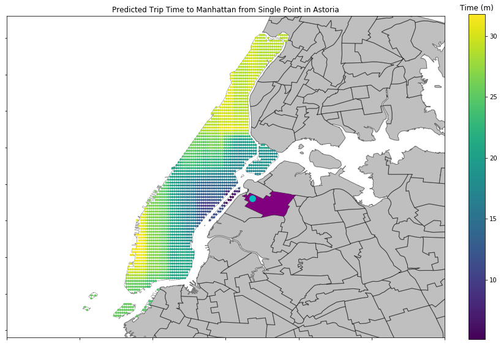
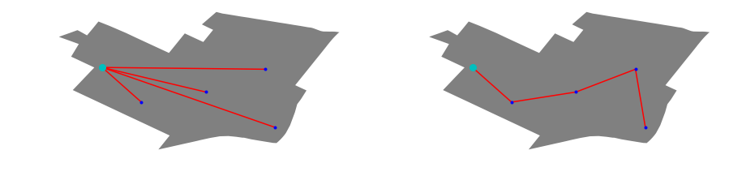
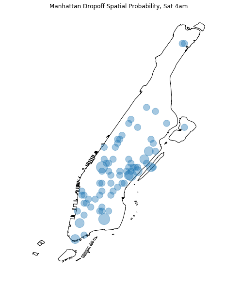

# Ride Sharing Efficiency

In this project I generated a metric that quantifies the efficient between using a ride sharing taxi service versus the traditional New York City taxi service between Manhattan and Astoria, Queens.

## Data ([Data Prep Extraction.ipynb](https://github.com/efandrade/nycRSmetric/blob/master/Data%20Prep%20Extraction.ipynb))

The data collected from http://www.nyc.gov/html/tlc/html/about/trip_record_data.shtml was for June 2016 for the yellow cab and green cab service. The relevant data used in this analysis consists of:
* **weekday**: The day of the week from 0-6 where 0 is Monday and 6 is Sunday
* **hour**: The hour in the day from 0-23 whhere 0 is 12am and 23 is 11pm
* **pickup_on**: The logitudinal coordinate for passenger pick up location
* **pickup_lat**: The latitudinal coordinate for passenger pick up location
* **dropoff_on**: The logitudinal coordinate for passenger drop off location
* **dropoff_lat**: The latitudinal coordinate for passenger drop off location
* **trip_distance**: The total distance traveled on the the road
* **trip_duration**: The today duration of the trip (seconds)
* **trip_cost**: The trip cost excluding tips (dollars)

## Random Forrest Duration Model ([Trip Duration Random Forrest Models.ipynb](https://github.com/efandrade/nycRSmetric/blob/master/Data%20Prep%20Extraction.ipynb))

I want to predict the time it takes for a cab to go from the pickup point to the dropoff point. Using the data available from NYC, I trained 4 random forest models to predict trip time. I chose to use a random forest model in order to account for non-linear effect in how long it takes cabs to complete a ride (e.g. traffic) given the features in the NYC taxi data. I trained 4 models to predict trip duration:

* Trip time for rides originating in Astoria going to Astoria
* Trip time for rides originating in Astoria going to Manhattan
* Trip time for rides originating in Manhattan going to Astoria
* Trip time for rides origination in Manhattan going to Manhattan

## Pickup and Dropoff Model ([Analysis.ipynb](https://github.com/efandrade/nycRSmetric/blob/master/Analysis.ipynb))

To model combining riders from the NYC taxi network, I decided to set a predetermined pick location. From this pickup location 1 to 4 riders will board the cab and then the cab will proceed to the closest dropoff destination (measured by the strait distance between the 2 points, not by the road distance). After reaching that destination, the cab will again proceed to the next closest drop off destination.

For the same pickup and dropoff points, a NYC taxi would simply start at the pickup point and end at the dropoff point per rider. In order to compare how my ride aggregator model does against the NYC taxi, I generate new pickup and dropoff points where the pickup is one location and the destinations can be at separate locations.

I generate new random sets of pickup and dropoff locations. I do this by finding the spatial probability for the pickup points and the dropoff points from the data we have gathered from NYC.

